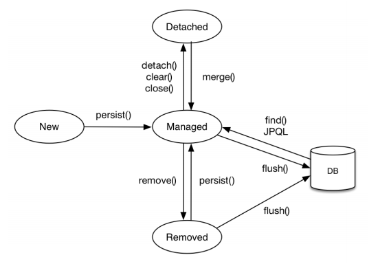

# 03장 영속성 관리


## 영속성 컨텍스트
```
EntityManager.persist(entity);
```
* 엔티티를 영구 저장하는 환경을 의미한다.
* 논리적인 개념이므로 눈에 보이지 않는다.
* 접근하려면 `엔티티 매니저`를 이용해야 한다.

### 엔티티 매니저
* (J2SE) 엔티티 매니저: 영속성 콘텍스트 = 1:1
* (J2EE, spring) 앤티티 매니저: 영속성 콘텍스트 = N:1

### 엔티티 생명주기


#### 비영속(new/transient)
```
//객체를 생성한 상태(비영속) 
Member member = new Member(); 
member.setId("member1"); 
member.setUsername("회원1");
```
* 영속성 콘텍스트와 전혀 관계가 없는 새로운 상태

#### 영속(managed)
```
//객체를 생성한 상태(비영속) 
Member member = new Member(); 
member.setId("member1"); 
member.setUsername(“회원1”);
EntityManager em = emf.createEntityManager();
em.getTransaction().begin();
//객체를 저장한 상태(영속)
em.persist(member);
```
* 영속성 컨텍스트에 관리되는 상태

#### 준영속(detached)
```
//특정 엔티티를 영속성 컨텍스트에서 분리, 준영속 상태 
em.detach(entity)
// 영속성 컨텍스트를 완전히 초기화
em.claer()
// 영속성 컨텍스트를 종료
em.close() 
```
* 영속성 컨텍스트에 저장되었다가 분리된 상태
* 영속 상태의 엔티티가 영속성 컨텍스트에서 분리된 상태
* 영속성 컨텍스트가 제공하는 기능을 사용할 수 없음


#### 삭제(removed)
```
//객체를 삭제한 상태(삭제) 
em.remove(member);
```
* 삭제된 상태

### 영속성 컨텍스트의 장점
1. 1차 캐시
   ```
   // 엔티티를 생성한 상태 (비영속)
   Member member = new Member();
   member.setId("member1");
   member.setUsername("회원1");
    
   // 엔티티를 영속, 1차 캐시에 저장됨
   em.persist(member);
   
   // 1차 캐시에서 조회
   Member findMember = em.find(Member.class, "member1");
   
   // 1차 캐시에 없다면 DB 조회 후 1차 캐시에 저장해서 반환
   Member findMember2 = em.find(Member.class, "member2");
   ```
2. 동일성(identity) 보장
    ```
    Member a = em.find(Member.class, "member1"); 
    Member b = em.find(Member.class, "member1");
    System.out.println(a == b); //동일성 비교 true
    ```
   * 1차 캐시로 반복 가능한 읽기(repeatable read) 등급의 트랜잭션 격리 수준을 DB가 아닌 애플리케이션 차원에서 제공


3. 트랜잭션을 지원하는 쓰기 지연 (transactional write-behind)
    ```
    EntityManager em = emf.createEntityManager();
    EntityTransaction transaction = em.getTransaction();
    
    //엔티티 매니저는 데이터 변경시 트랜잭션을 시작해야 한다.
    transaction.begin(); // 트랜잭션 시작
    em.persist(memberA);
    em.persist(memberB);
    //여기까지 INSERT SQL을 데이터베이스에 보내지 않는다.
    
    //커밋하는 순간 데이터베이스에 INSERT SQL을 보낸다.
    transaction.commit(); // 트랜잭션 커밋

    ```

4. 변경 감지 (dirty checking)
    ```
    EntityManager em = emf.createEntityManager();
    EntityTransaction transaction = em.getTransaction();
    transaction.begin(); // 트랜잭션 시작
    
    // 영속 엔티티 조회
    Member memberA = em.find(Member.class, "memberA");
    
    // 영속 엔티티 데이터 수정
    memberA.setUsername("hi");
    memberA.setAge(10);
    
    //em.update(member) 이런 코드가 있어야 하지 않을까?
    transaction.commit(); // 트랜잭션 커밋

    ```
   * flush() 가 발생하면 엔티티와 스냅샷을 비교
   * update sql을 생성 후 flush로 db에 반영 후 commit


5. 지연 로딩 (lazy loading)

   * 로딩 시점에 lazy 설정이 되어있는 엔티티는 프록시 객체로 가져온다.
    * 실제 객체를 사용하는 시점에 초기화가 되고 db에 쿼리가 나간다.

## 플러시
* 영속성 콘텍스트의 변경내용을 DB에 반영
* 변경 감지 -> 수정된 엔티티 쓰기 지연 SQL 저장소에 등록 -> 쓰기 지연 SQL저장소의 쿼리를 DB에 전송
* 영속성 컨텍스트 내용을 DB에 동기화 하며, 영속성 콘텍스트를 비우지 않음
* `트랜잭션` 작업 단위가 중요하며, 커밋 직전에만 동기화 하면 됨

### 영속성 컨텍스트를 플러시하는 방법
```
// (1) 직접 호출
em.flush();

// (2) 트랜잭션 커밋 시 플러시 자동 호출
transaction.commit();

// (3) JPQL 쿼리 실행 시 플러시 자동 호출
em.persist(memberA);
em.persist(memberB);
em.persist(memberC);
//중간에 JPQL 실행
query = em.createQuery("select m from Member m", Member.class);
List<Member> members= query.getResultList();
```
### 플러시 모드 옵션
```
// 커밋이나 쿼리를 실행할 때 플러시 (기본값)
em.setFlushMode(FlushModeType.AUTO)

// 커밋할 때만 플러시
em.setFlushMode(FlushModeType.COMMIT)
```